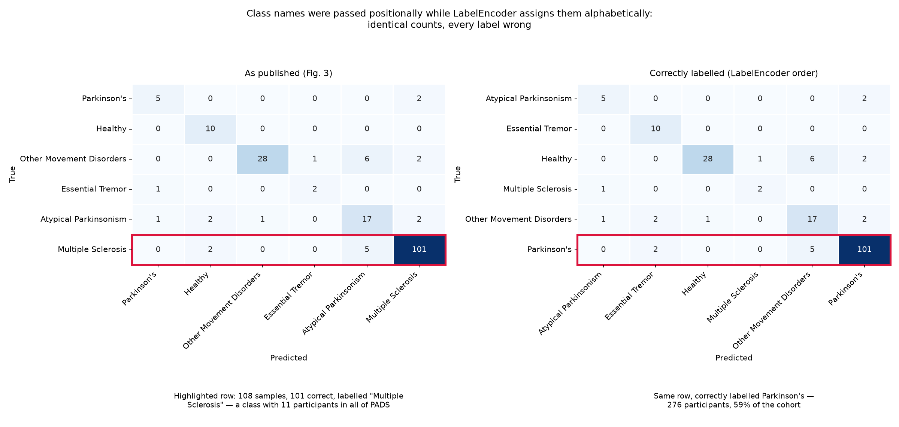

# Parkinson's Classification from Smartwatch Data — A Reproduction Study

Reproduction of my 2025 undergraduate capstone on classifying Parkinson's
disease from wrist-worn accelerometer and gyroscope recordings in the
[PADS dataset](https://physionet.org/content/parkinsons-disease-smartwatch/1.0.0/)
(469 participants, 11 motor tasks, both wrists).

The original pipeline — MiniRocket feature extraction into a small MLP — is
reimplemented here and reproduces the published results to within noise.
Re-running it under a corrected evaluation protocol shows that the reported
gains over the PADS reference study were an artefact of **data leakage**:
augmentation was applied before the train/test split, so most test recordings
had a near-identical synthetic copy in the training set. Corrected results match
the reference baseline on PD vs healthy controls and fall below it on PD vs
other movement disorders.

The original manuscript is preserved unmodified in [`paper/`](paper/) — as
written in 2025, and superseded by the results below.

---

## Results

Balanced accuracy, mean ± standard deviation over 5 seeds.

| Task | Published (2025) | Reproduced, leaky | Corrected, clean |
|---|---:|---:|---:|
| PD vs Healthy (355-subject subset) | 0.9289 | 0.948 ± 0.050 | **0.789 ± 0.059** |
| PD vs DD (3-class, all 469) | 0.8694 | 0.870 ± 0.017 | **0.645 ± 0.035** |
| PD vs All Classes (6-class, all 469) | 0.8775 | 0.796 ± 0.040 | **0.358 ± 0.067** |

The leaky column reproduces the published numbers for the first two settings —
the second to within 0.0006. The third is discussed under
[Table I row 1](#table-i-row-1-is-anomalous).

### Against the PADS reference study

Varghese et al. (2024), smartwatch only, acceleration + rotation:

| Task | PADS baseline | This work (clean) |
|---|---:|---:|
| PD vs HC | 0.7631 | 0.789 ± 0.059 |
| PD vs DD | 0.7498 | 0.638 ± 0.019 |

With leakage removed the method is statistically indistinguishable from the
baseline on PD vs HC — the 2.6-point margin is roughly one standard error across
seeds — and clearly below it on PD vs DD. The published margins do not survive a
leak-free protocol.

The six-class setting collapses to 0.358 against a 0.167 floor. With rare
classes at 11–28 participants, this pipeline does not do six-way movement
disorder classification in any useful sense.

---

## The leak

The original pipeline ran in this order:

```
process_data.py         469 recordings, one row per participant
augment.py              append a jittered/scaled copy of every row -> 938 rows
feature_extraction.py   MiniRocket.fit() on all 938 rows
deep_learning.py        train_test_split(test_size=0.2)   <- random, row-level
```

Augmentation runs before the split, so each participant appears twice — once
real, once as a near-identical synthetic copy — and a random row-level split has
no idea the two are the same person.

The augmentations are deliberately gentle (Gaussian jitter at `sigma=0.01`,
magnitude scaling within ±10%), and MiniRocket's proportion-of-positive-values
features are largely insensitive to perturbations that small. A row and its twin
sit at almost the same point in 9,996-dimensional feature space.

For any participant, the chance their twin falls on the other side of an 80/20
split is `2 × 0.8 × 0.2 = 32%`. From the test set's side it is worse: each test
row's twin is in training with probability 0.8, so roughly **150 of the 188 test
rows had a near-duplicate the model had already seen**.

A second, milder leak: `MiniRocket.fit()` saw the full dataset before the split.
The manuscript (§IV.B) states the transformer was "fitted on the training set
and subsequently used to transform both the training and validation splits" —
the code did not do that.

`--protocol clean` fixes both: split by subject, then augment and fit on the
training split only.

### What it was worth

| Task | leaky | clean | delta |
|---|---:|---:|---:|
| PD vs Healthy | 0.948 | 0.789 | **−0.158** |
| PD vs DD (3-class) | 0.870 | 0.645 | **−0.224** |
| PD vs All Classes | 0.796 | 0.358 | **−0.438** |

The damage scales with class rarity, which is what the mechanism predicts: the
six-class setting leans on classes with 11–28 participants, where one memorised
twin is a large share of everything the model has seen of that class.

---

## Two further defects in the original reporting

### The confusion matrix axes are wrong

Class names were passed to the plot positionally:

```python
class_labels = ["Parkinson's", "Healthy", "Other Movement Disorders",
                "Essential Tremor", "Atypical Parkinsonism", "Multiple Sclerosis"]
```

`sklearn.LabelEncoder` assigns integers in **alphabetical** order, which is a
different ordering, so every axis label in Fig. 3 of the manuscript names the
wrong class:




| Labelled | Actually | n | Correct |
|---|---|---:|---:|
| Parkinson's | Atypical Parkinsonism | 7 | 5 |
| Healthy | Essential Tremor | 10 | 10 |
| Other Movement Disorders | Healthy | 37 | 28 |
| Essential Tremor | Multiple Sclerosis | 3 | 2 |
| Atypical Parkinsonism | Other Movement Disorders | 23 | 17 |
| Multiple Sclerosis | **Parkinson's** | 108 | 101 |

Decoding the release settles it: PADS contains **11 Multiple Sclerosis
participants in total**, so that row of 108 test samples cannot be MS. It is
Parkinson's, the largest class at 59% of the cohort. Every row then matches its
expected share to within sampling noise.

So the manuscript's "Key Observations" paragraph is inverted — the 101 correct
predictions are Parkinson's, not Multiple Sclerosis. The headline claim, that
the model detects PD well, is better supported than the paper states; the
narrative around it is wrong.

`evaluate.plot_confusion_matrix` now derives names from `encoder.classes_`, so
codes and labels cannot desync.

### The three task settings were defined inconsistently

The manuscript names three settings and defines none of them. They were
recovered from the arithmetic of the published accuracies: accuracy can only
take values `k/n`, so the denominator that makes each published figure an exact
integer gives away the test-set size.

| Published row | Accuracy | Integer fit | n test | Therefore |
|---|---:|---|---:|---|
| PD vs All Classes | 0.9096 | 171/188 | 188 | all 469 participants |
| PD vs DD | 0.8989 | 169/188 | 188 | all 469 participants |
| PD vs Healthy | 0.9648 | **137/142** | 142 | 355-subject subset |

No integer over 188 yields 0.9648; 137/142 does, uniquely — and 142 is exactly
the PD+Healthy subset doubled and split (355 × 2 × 0.2).

So "PD vs Healthy" filtered the cohort while "PD vs DD" relabelled it into three
classes, keeping healthy controls as their own group. Two different schemes,
consistent with settings toggled by hand across separate sessions. Task names in
this repository describe what the code does, with the manuscript's names noted
alongside.

### Table I row 1 is anomalous

The "PD vs All Classes" row reports 0.8775 balanced accuracy. The six-class
reproduction gives 0.796 ± 0.040. But the manuscript's own Fig. 3 — a genuine
six-class confusion matrix — implies **0.802** from its cell counts. The
reproduction agrees with the figure; Table I disagrees with the figure printed
beside it. The discrepancy is internal to the manuscript, and with the original
runs gone there is no way to establish how that row got its numbers.

---

## Setup

```bash
python -m venv .venv && source .venv/bin/activate
pip install -r requirements.txt
```

PADS is open access, no credentialing. Only `preprocessed/movement/` (the 469
`.bin` recordings) and `patients/` (the labels) are needed — about 242 MB rather
than the 770 MB full archive:

```bash
D=data/pads-parkinsons-disease-smartwatch-dataset-1.0.0
B=https://physionet.org/files/parkinsons-disease-smartwatch/1.0.0
for sub in preprocessed/movement patients; do
  wget -r -N -c -np -nH --cut-dirs=3 -R "index.html*" -P "$D" "$B/$sub/"
done
```

PhysioNet throttles per-file requests, so expect 15–20 minutes. `-c` makes it
resumable. Then decode the binaries once:

```bash
python src/process_data.py --root data/pads-parkinsons-disease-smartwatch-dataset-1.0.0
```

Each `.bin` is exactly 515,328 bytes = 132 channels × 976 samples × 4 bytes,
which `process_data.py` verifies rather than assumes.

## Running

```bash
python src/run_experiment.py --protocol clean --task six_class
python src/run_experiment.py --protocol leaky --task six_class   # the 2025 pipeline
```

Tasks are `six_class`, `pd_vs_rest`, `pd_hc_other`, `subset_pd_hc`,
`subset_pd_dd`. Metrics, per-epoch history and figures land in `results/`.

Multi-seed sweeps, which is how every number above was produced:

```bash
python tools/seed_sweep.py --seeds 42 43 44 45 46
python tools/seed_sweep.py --seeds 42 43 44 45 46 --tasks subset_pd_hc subset_pd_dd
```

Other flags: `--patience N` enables early stopping (off by default, since the
original had none), `--num-kernels` sets MiniRocket width (10,000 → 9,996
features), `--no-scale` disables feature standardisation.

## Tests

```bash
python tests/smoke_test.py
```

Runs both protocols end to end on synthetic data — no download needed — and
asserts the structural difference between them.

## Layout

```
src/
  extract_labels.py    patient JSON -> {id: condition}
  process_data.py      PADS .bin -> movement.npz
  augment.py           jitter, magnitude scaling, subject-tracked doubling
  features.py          MiniRocket fit/transform
  model.py             ROCKETMLP (9996 -> 128 -> 64 -> n_classes)
  evaluate.py          metrics and figures
  run_experiment.py    orchestration; --protocol leaky|clean
tools/
  seed_sweep.py            repeat across seeds, report mean +- std
  summarise.py             assemble results/*.json into tables
  task_definition_probe.py identify the original task definitions
  row_matching.py          match published rows to candidate experiments
  make_relabelling_figure.py  render the confusion-matrix relabelling figure
tests/smoke_test.py    end-to-end run on synthetic data
paper/                 the original manuscript
results/               metrics and figures
```

## Notes on the reconstruction

The original working tree was lost to a drive failure in 2025. The pipeline was
rebuilt from the manuscript and from surviving fragments: the model and training
loop verbatim, the first ~1 KB each of the preprocessing, augmentation and
feature-extraction scripts, and the label loader and plotting module inferred
from their call sites. Consequences worth knowing:

- Feature standardisation is required. Without it the MLP collapses to
  majority-class prediction (0.500 balanced accuracy on PD vs HC against 0.754
  with it), because every MiniRocket PPV feature has mean ≈ 0.5 and a
  9,996-dimensional input is swamped by that common-mode offset. `--no-scale`
  reproduces the collapse.
- How jitter and magnitude scaling were divided across the data is a guess. The
  dataset was doubled — corroborated by the test-set arithmetic — but the
  original partitioning is unrecoverable.
- Augmented rows were assigned `PatientID + 1000`, so subject identity survived
  into the augmented table. The feature-extraction step then kept only the
  sensor columns and the label, dropping `PatientID`. The information needed to
  prevent the leak existed one stage upstream and was discarded before the
  split.
- Results here run on sktime 1.1.0 and torch 2.13.0, both much newer than the
  2025 environment. MiniRocket's kernel selection has changed across versions,
  so the leaky protocol lands near the published numbers rather than exactly on
  them.

## Known gaps between the manuscript and the code

| Manuscript states | Original code did |
|---|---|
| learning rate 0.001 | `lr=0.002` |
| stratified 5-fold cross-validation | one `train_test_split` |
| early stopping on validation loss | none; ran all 20 epochs |
| batch normalization in the MLP | dropout only |
| softmax output layer (§III.D.1) | no activation (§IV.B is correct) |
| overlapping windows before MiniRocket | full series, no windowing |
| "JSON files' parsing" (§IV.A) | `.bin` files via `np.fromfile` |
| MiniRocket fit on the training set | fit on the full dataset |

§IV.A also attributes PADS to "Iakovakis et al." while reference [1] is Varghese
et al.; §II has it right.

## References

1. J. Varghese et al., "Machine learning in the Parkinson's disease smartwatch
   (PADS) dataset," *npj Parkinson's Disease*, vol. 10, p. 9, 2024.
2. A. Dempster, D. F. Schmidt, G. I. Webb, "MiniRocket: a very fast (almost)
   deterministic transform for time series classification," *KDD*, 2021.
